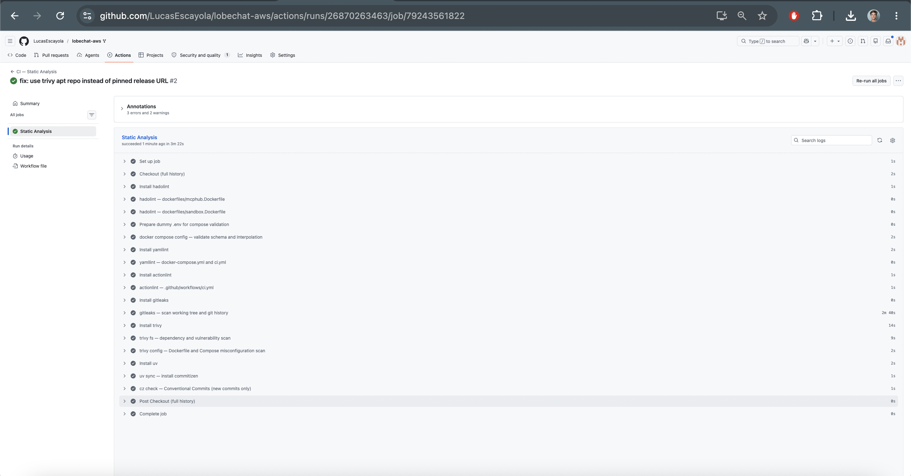

# CI Reasoning — Static Analysis Pipeline

## Evidence



**Actions run URL:** https://github.com/LucasEscayola/lobechat-aws/actions/runs/26870263463
**Commit SHA the run executed against:** `4c71bb7`

---

## Part A — Why what I did matters (repository-specific)

### Why the pipeline is build-free

`docker-compose.yml` lines 174–180 declare a `vllm` service that requires an
NVIDIA GPU (`driver: nvidia, count: 1, capabilities: [gpu]`) with a
`start_period: 300s` healthcheck (line 187). GitHub-hosted runners have no GPU
and cannot start this service, which means the full 11-service dependency graph
cannot be brought up. `lobe-chat` itself waits on `vllm: service_healthy` (line
79), so even the web UI would never pass its health gate. Attempting `docker
compose up` would deadlock the job.

### Why `tests/` are excluded

`tests/test_vllm.py` (line 10) imports `openai` and `httpx` and creates an
`OpenAI` client pointed at `http://localhost:47007/v1` (line 14) — a running
vLLM endpoint. `tests/test_mcp_ssh.py` (line 8) depends on `mcp[cli]` and
`httpx` to connect to a live SSH server via MCPHub. These are live-stack
integration tests, not unit tests; they cannot execute without the full stack
running.

### Why the Compose interpolation fix is safe

`cp .env.example .env` inside the job supplies only placeholder values (e.g.
`AUTH_CASDOOR_ID=your-casdoor-app-id`, `OPENROUTER_API_KEY=sk-or-v1-your-openrouter-api-key`).
The real `.env` is excluded from git by `.gitignore` (line: `# Environment files with secrets` → `.env`),
so the copy is **never committed**. `OPENAPI_MCP_HEADERS` is not in
`.env.example` (it carries a live Notion bearer token), so one additional line
`OPENAPI_MCP_HEADERS={}` is appended — still a non-secret placeholder.
`gitleaks` scans the git working tree and history; because `.env` is gitignored
and `.env.example` contains no real secrets, a clean tree will not produce real
findings. No committed secrets are claimed.

---

### Gate-by-gate risk analysis

#### 1. hadolint on `dockerfiles/mcphub.Dockerfile` — unpinned base image and root runtime

`dockerfiles/mcphub.Dockerfile` line 1:
```
FROM samanhappy/mcphub:latest
```
Using `:latest` means every `docker pull` may fetch a different image layer,
breaking reproducibility and silently introducing upstream vulnerabilities or
behaviour changes with no version control. hadolint flags `DL3007` (avoid
`:latest`).

Line 5: `USER root` — the Dockerfile switches to root for package installation
and **never drops back to an unprivileged user**. Any code running inside the
mcphub container (including arbitrary MCP tool calls from LobeChat) executes as
uid 0. hadolint flags `DL3002`.

Line 7: `apt-get install … docker.io` — installing the Docker CLI into the
runtime image gives the container (running as root) the ability to manage the
host Docker daemon via the bind-mounted socket (`docker-compose.yml` line 110:
`/var/run/docker.sock:/var/run/docker.sock`). This is a container-escape risk:
any RCE inside mcphub becomes full host root.

#### 2. hadolint on `dockerfiles/sandbox.Dockerfile` — unpinned installs and NOPASSWD sudo

`dockerfiles/sandbox.Dockerfile` lines 43–45 install `kubectl` by fetching
`https://dl.k8s.io/release/stable.txt` to determine the version and then
downloading the binary — no checksum verification, no pinned version. An
attacker who controls the CDN response (or via DNS hijack) can substitute a
malicious binary that gets installed and marked executable.

Lines 49–52: `eksctl` is installed from
`github.com/eksctl-io/eksctl/releases/latest/download/…` — also unpinned and
unchecked.

Lines 57–64: `zellij` from `github.com/zellij-org/zellij/releases/latest/…` —
same pattern.

Line 21: `echo 'oriol ALL=(ALL) NOPASSWD:ALL' > /etc/sudoers.d/oriol` grants
the `oriol` user passwordless root inside the container. Combined with the
bind-mounted `~/.ssh` (line 217 of `docker-compose.yml`) this means any
compromised MCP tool call in the linux-sandbox can escalate to root and pivot
to the host via SSH.

#### 3. trivy config — sslmode=disable and unencrypted database connections

`docker-compose.yml` line 13 (Casdoor `dataSourceName`):
```
sslmode=disable dbname=casdoor
```
Line 33 (LobeChat `DATABASE_URL`):
```
DATABASE_URL=postgresql://postgres:${POSTGRES_PASSWORD:-postgres}@postgres:5432/lobechat
```
No `sslmode=require` or TLS parameters are set. All Postgres traffic between
the application containers and the shared-postgres service is unencrypted on
the Docker bridge network. If an attacker gains access to the Docker network
(e.g. via a compromised service), they can read or inject SQL queries in
plaintext. trivy config surfaces this as a misconfiguration.

#### 4. trivy config — bind-mounted host AWS credentials in mcphub

`docker-compose.yml` line 108:
```yaml
- ~/.aws:/root/.aws:ro
```
The host user's AWS credentials directory is mounted into the `mcphub`
container (as root's home). Any vulnerability or malicious MCP server that
achieves code execution inside mcphub can read `~/.aws/credentials` and make
arbitrary AWS API calls with the host user's permissions. A production pipeline
must replace this with short-lived credentials via OIDC federation.

#### 5. gitleaks — scanning for secrets in git history

`.env.example` contains commented-out AWS credential placeholders
(`AWS_ACCESS_KEY_ID`, `AWS_SECRET_ACCESS_KEY`, `AWS_SESSION_TOKEN`) and
API-key-shaped strings (`sk-or-v1-…`, `hf_your-huggingface-token`). gitleaks
scans the full git history to verify no real keys were ever committed, even if
later deleted — a deleted file still appears in `git log`. The `.gitignore`
already excludes `.env`, `aws_credentials.yaml`, `*.pem`, and `config/ssh/`;
on a clean tree gitleaks is expected to pass cleanly, surfacing that no real
secrets were committed.

#### 6. docker compose config — validates the 11-service graph without starting it

Running `docker compose -f docker-compose.yml config -q` parses and interpolates
the entire compose file — all 11 services, their dependencies, healthchecks, and
volume definitions — and exits non-zero on any YAML or schema error. This is the
lightest possible correctness gate: it catches typos, missing required fields, and
unresolved `${VAR}` references before any container is pulled or started.

---

## Part B — What is missing for a real production CI/CD (delivery)

### What was built vs. what is needed

The `.github/workflows/ci.yml` built in Deliverable 1 is **Continuous
Integration**: it runs static quality and security gates on every push and pull
request, giving fast feedback on obvious defects without running the
application. It **stops short of Continuous Delivery or Deployment** — it never
builds an image, pushes an artifact, configures cloud infrastructure, or
deploys any service. A real production pipeline for this system requires at
least the following additions.

---

### 1. Build, tag, sign, and push images to a registry

`dockerfiles/mcphub.Dockerfile` and `dockerfiles/sandbox.Dockerfile` are built
locally via `docker compose build mcphub` / `docker compose build linux-sandbox`
(`docker-compose.yml` lines 82–85 and 211–214). There is no CI step that builds
these images to a versioned, immutable digest and pushes them to a registry (e.g.
Amazon ECR). Without this, a deploy on a fresh EC2 instance rebuilds from the
`:latest` base (`samanhappy/mcphub:latest` line 1 of `mcphub.Dockerfile`,
`ubuntu:24.04` in `sandbox.Dockerfile`) and the result is not reproducible.

A real CD stage would: `docker build` → tag with `git rev-parse --short HEAD` →
push to ECR → resolve the `docker-compose.yml` `:latest` pulled images
(`qdrant/qdrant:latest` line 114, `minio/minio:latest` line 190,
`lobehub/lobe-chat-database` line 21 — no tag at all) to their current immutable
digests so a redeploy is byte-for-byte reproducible.

### 2. Replace static AWS credentials with GitHub OIDC federation

`docker-compose.yml` line 108 bind-mounts `~/.aws:/root/.aws:ro` from the host
into the `mcphub` container. `.env.example` lines 61–63 show the commented-out
fallback pattern (`AWS_ACCESS_KEY_ID`, `AWS_SECRET_ACCESS_KEY`,
`AWS_SESSION_TOKEN`). Both patterns use long-lived or host-bound credentials.

A production pipeline would configure an IAM OIDC identity provider for
`token.actions.githubusercontent.com` and use `aws-actions/configure-aws-credentials`
in the deploy job to assume a scoped IAM role with a 15-minute token — no
standing credentials in CI, no credentials mounted in containers, no risk of
credential leakage from a compromised runner.

### 3. Inject secrets at deploy time from AWS Secrets Manager / SSM Parameter Store

All secrets (`NEXT_AUTH_SECRET`, `KEY_VAULTS_SECRET`, `AUTH_CASDOOR_SECRET`,
`OPENROUTER_API_KEY`, `HF_TOKEN`, `OPENAPI_MCP_HEADERS`) are currently passed
as plaintext environment variables in `docker-compose.yml` resolved from `.env`
on the host. The final-project mandate (§2.2) requires secrets to be managed in
SSM Parameter Store or Secrets Manager.

A CD pipeline would pull secrets via `aws ssm get-parameter --with-decryption`
(or `aws secretsmanager get-secret-value`) during the deploy job and inject them
as ephemeral environment variables into the compose invocation — never baking
them into images, compose files, or runner logs.

### 4. Database migration stage with destructive-command guard

`db/flyway/provision.sh` orchestrates Flyway migrations across three databases
(`lobechat`, `casdoor`, `litellm`). Line 10 of that script documents a `clean`
subcommand that **drops all rows and resets migration history** — running it
accidentally in production destroys all user data.

A real CD pipeline needs an explicit migration stage that: (a) runs
`provision.sh migrate` (not `clean`) against the target database, (b) gates on
migration success before routing traffic to the new app version, and (c) places
the `clean` subcommand behind a manual approval step with environment protection
so it can never be triggered automatically.

### 5. Environment promotion with manual approval gates

Today there is a single EC2 target ("production"). A mature delivery pipeline
for this system would have at minimum: `dev` (auto-deploy on merge to main) →
`staging` (auto-deploy, runs `tests/` against a real stack) → `prod` (manual
approval required, uses GitHub protected environments). The final project's Q2
promotion flow requires human sign-off before prod deploys; today nothing
enforces that in CI.

### 6. Deploy mechanism to the EC2 target (no shell access on port 47000)

There is currently no CI deploy step. The running stack lives on an EC2 instance
behind a Caddy reverse proxy (`docker-compose.yml` `extra_hosts` line 25 shows
the `HOST_DOMAIN` pattern). A CD job would need to reach the instance — via AWS
Systems Manager Run Command (no SSH port required), or a locked-down SSH jump —
to run `docker compose pull && docker compose up -d` with the new image digests.

`patches/route.js` (a ~3 MB LobeChat monkeypatch committed to the repo root)
must also be applied at deploy time. Today it is handled out-of-band. A
production pipeline should bake the patch into a forked `lobehub/lobe-chat-database`
image pinned to a specific digest rather than relying on a runtime mount — making
the deploy artifact self-contained and removing the dependency on a committed blob.

### 7. Post-deploy smoke tests and health gates

Several services in `docker-compose.yml` lack healthchecks: `casdoor` (line 2),
`lobe-chat` (line 20), `mcphub` (line 81), `hayhooks-mcp` (line 142), and
`linux-sandbox` (line 210) have no `healthcheck:` block. After a deploy the
pipeline has no automated signal that the new version is serving traffic.

A real CD pipeline would run the live integration tests in `tests/` (which hit
`http://localhost:47007/v1` for vLLM, the MCPHub REST API at port 47008, and
MinIO at port 47005) against an **ephemeral staging environment** to verify
end-to-end health before promoting to production.

### 8. Automated rollback

Because the current deploy unit is an unpinned image (`:latest`) and the
compose file carries no version field, there is no automated rollback path.
If a deploy is bad, an operator must manually `docker compose down && docker
compose up -d` with the previous image — and "the previous image" has already
been overwritten by the new `:latest` pull.

A real pipeline would tag images with a git SHA, keep the previous digest in
SSM, and have a rollback job that re-deploys the last-known-good digest via
the same deploy mechanism used for promotion.

### 9. Branch protection and signed release tags

The `main` branch on `LucasEscayola/lobechat-aws` currently has no required
status checks, no protected environment rules, and no merge restrictions. Any
commit can be pushed directly to main without passing CI. A production setup
requires: branch protection requiring the `static-analysis` job to pass before
merge, signed release tags via `cz bump` (the repo already uses Commitizen with
`tag_format = "v$version"` in `pyproject.toml` line 23), and CODEOWNERS for
critical paths like `db/flyway/` and `dockerfiles/`.

---

### Prioritisation — Single highest-value next step

**OIDC federation and secret injection (items 2 + 3 above) is the single
highest-value next step.**

Today the EC2 host's `~/.aws` credentials are bind-mounted into the `mcphub`
container (`docker-compose.yml` line 108) and would need to be replicated into
a CI runner to deploy. Long-lived AWS credentials in a runner are a standing
blast radius: one leaked token grants unrestricted AWS access indefinitely.
Replacing this with a GitHub OIDC identity provider and a 15-minute-scoped IAM
role removes all standing credentials from CI, eliminates the most severe
supply-chain risk, and is a prerequisite for every subsequent automation step
(deploy, migration, rollback) — making it the highest-leverage change before
anything else is automated.
