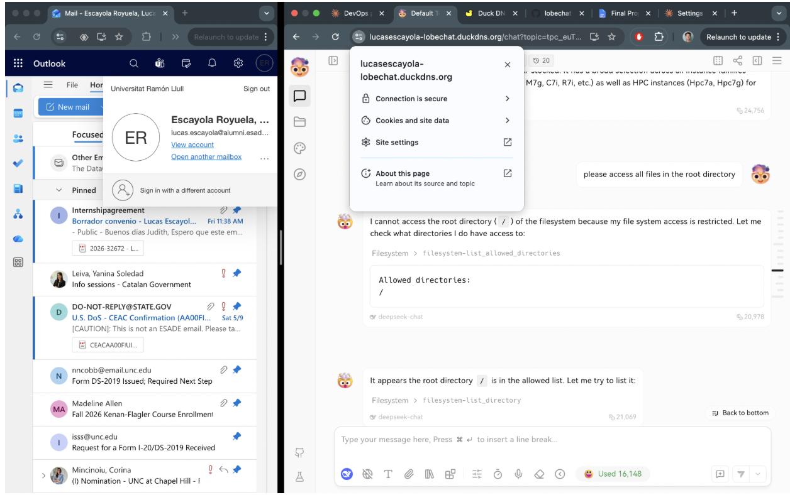

# Final Project — Evidence Report

## 1. Identity

| Field | Value |
|---|---|
| Student name | Lucas Escayola Royuela |
| ESADE email | lucas.escayola@alumni.esade.edu |
| GitHub repo URL | https://github.com/LucasEscayola/lobechat-aws (private; user `joseporiolrius` invited as collaborator) |
| Latest commit SHA | 16a3c4e9cbc6f9bde13930e1a0cdd0b471c852be |
| Final tag | final-v0.7.0 |

## 2. Public URL

**[https://lucasescayola-lobechat.duckdns.org](https://lucasescayola-lobechat.duckdns.org)**

## 3. Screenshot — LobeChat over HTTPS, logged in


## 4. Screenshot — chat working (streaming + MCP)



## 5. Public reachability — `curl -sI https://lucasescayola-lobechat.duckdns.org/`

```
$ curl -sI https://lucasescayola-lobechat.duckdns.org/
HTTP/2 307
alt-svc: h3=":443"; ma=2592000
cache-control: no-store, no-cache, must-revalidate
date: Sun, 31 May 2026 17:32:38 GMT
location: /chat
via: 1.1 Caddy
```

## 6. Negative test — port 47000 closed

```
$ curl -v --max-time 5 http://18.202.89.106:47000/
*   Trying 18.202.89.106:47000...
* Connection timed out after 5002 milliseconds
* Closing connection
curl: (28) Connection timed out after 5002 milliseconds
```

## 7. Stack runtime — `docker compose ps`

```
$ docker compose ps
NAME              IMAGE                               STATUS                 PORTS
casdoor           casbin/casdoor:v2.13.0              Up 46 minutes          0.0.0.0:47002->8000/tcp
hayhooks          deepset/hayhooks:v1.1.0             Up 6 hours             0.0.0.0:47012->1416/tcp
hayhooks-mcp      deepset/hayhooks:v1.1.0             Up 6 hours             0.0.0.0:47013->1417/tcp
linux-sandbox     lobechat-aws-linux-sandbox:latest   Up 6 hours
lobe-chat         lobehub/lobe-chat-database          Up 13 minutes          0.0.0.0:47000->3210/tcp
mcphub            lobechat-aws-mcphub:latest          Up 6 hours             0.0.0.0:47008->3000/tcp
minio             minio/minio:latest                  Up 6 hours (healthy)   0.0.0.0:47005->9000/tcp, 0.0.0.0:47006->9001/tcp
qdrant            qdrant/qdrant:latest                Up 6 hours (healthy)   0.0.0.0:47010->6333/tcp, 0.0.0.0:47011->6334/tcp
shared-postgres   pgvector/pgvector:pg16              Up 6 hours (healthy)   0.0.0.0:47003->5432/tcp
```
