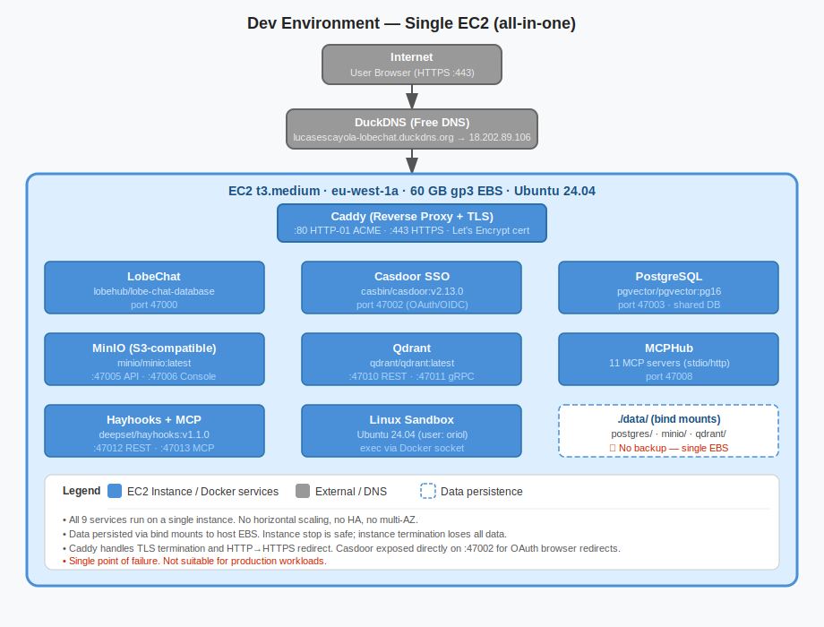
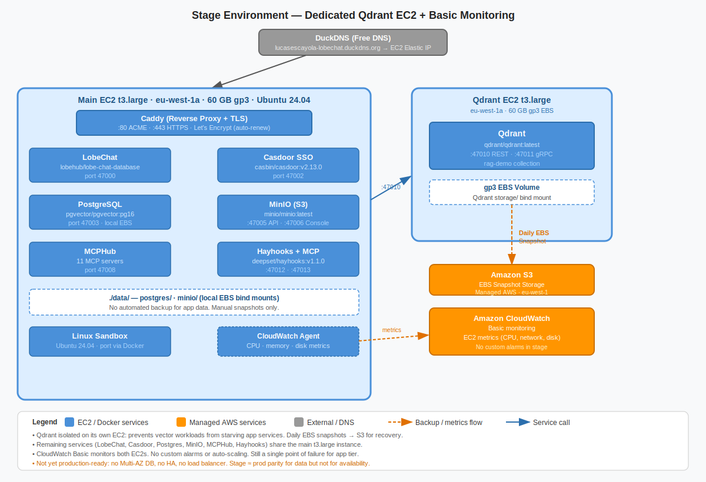
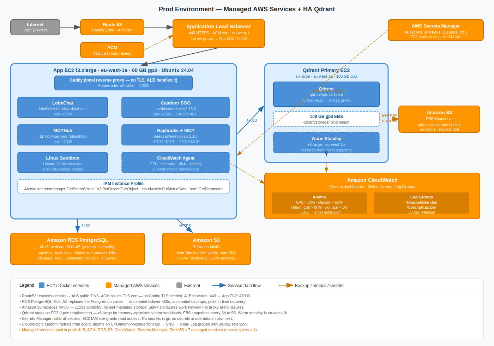

# Q2 — 3-Environment Architecture Evolution

## Per-Environment Component Table

The stack evolves across three environments with increasing reliability, managed services, and operational rigour. Dev prioritises low cost and fast iteration. Stage mirrors prod topology at reduced scale. Prod uses AWS managed services for durability and observability.

| Component | Dev | Stage | Prod |
|---|---|---|---|
| LobeChat | t3.medium, Docker Compose | t3.large, Docker Compose | t3.xlarge, Docker Compose, auto-restart |
| Casdoor | Same EC2, port 47002 | Same EC2, port 47002 | Same EC2, behind ALB |
| Postgres | Same EC2, pgvector container | Same EC2, pgvector container | RDS PostgreSQL 16, pgvector, Multi-AZ |
| MinIO | Same EC2, local bind mount | Same EC2, local bind mount | Replaced by S3 in eu-west-1 |
| Qdrant | Same EC2, 20 GB EBS | Dedicated t3.large, 100 GB EBS | Dedicated r6i.large, 500 GB EBS gp3 |
| MCPHub | Same EC2, all 11 servers | Same EC2, subset of servers | Same EC2, all servers, health monitoring |
| Hayhooks | Same EC2 | Same EC2 | Same EC2, connected to prod Qdrant |
| LLM Backend | DeepSeek API | DeepSeek API | DeepSeek API + Bedrock fallback |
| Secrets | .env file, chmod 600 | SSM Parameter Store | SSM Parameter Store + Secrets Manager |
| TLS | Caddy + DuckDNS | Caddy + DuckDNS | ALB + ACM, Route53 |
| Monitoring | None | CloudWatch basic | CloudWatch + alarms + dashboards |

## Qdrant on EC2 — Sizing, Snapshots, Recovery

Qdrant runs on EC2 in all three environments because no native managed vector database exists in AWS, meaning the only alternative would be a third-party service introducing data residency risks and vendor lock-in. Qdrant performance is also sensitive to memory bandwidth and disk I/O, making a dedicated memory-optimised instance worthwhile in prod.

In dev, Qdrant runs co-located on the main EC2 instance with 20 GB EBS gp3. No snapshots are taken. If the instance is terminated the vector index is lost and must be re-ingested, which is acceptable since the knowledge base is small and re-ingestion takes under 10 minutes.

In stage, Qdrant moves to a dedicated t3.large with 100 GB EBS gp3. Daily EBS snapshots run with a 7-day retention window. Recovery involves restoring the snapshot to a new volume, with an expected RTO of approximately 30 minutes.

In prod, Qdrant runs on a dedicated r6i.large chosen for its memory-to-CPU ratio, improving vector search performance at scale. The EBS volume is 500 GB gp3 with 250 MB/s provisioned throughput. Daily snapshots run with 30-day retention. A secondary warm standby instance replicates the Qdrant collection via the snapshot API every 15 minutes, storing snapshots in S3. On instance failure, the standby promotes automatically via a Route53 health check with an expected RTO under 5 minutes.

## AWS Managed Services in Prod

The prod environment uses six AWS managed services, exceeding the minimum requirement of four.

Amazon RDS PostgreSQL 16 replaces the containerised pgvector instance, providing automated backups with 7-day retention, point-in-time recovery, Multi-AZ failover, and managed minor version upgrades. The pgvector extension is supported natively, eliminating the biggest single point of failure in the current architecture.

Amazon S3 replaces MinIO. The lobe bucket moves to S3 in eu-west-1 with versioning enabled and a lifecycle policy transitioning objects older than 90 days to Infrequent Access. LobeChat's S3-compatible client requires no code changes.

AWS Secrets Manager stores all application secrets in prod. The EC2 instance profile is granted secretsmanager:GetSecretValue on the lobechat/secrets path and the userdata.sh bootstrap script pulls secrets at launch time. In the ESADE sandbox, ssm:PutParameter was blocked by the IAM policy attached to the SSO role, preventing full implementation. The correct pattern is to create a dedicated EC2 instance role with a least-privilege policy granting only ssm:GetParameter on /lobechat/*, attached as an instance profile so the EC2 fetches secrets without human credentials. This is the architecturally correct approach despite the sandbox limitation that required writing the .env file manually.

An Application Load Balancer with ACM terminates HTTPS at the load balancer using auto-renewed certificates, eliminating the dependency on Caddy's Let's Encrypt integration and DuckDNS. The ALB also provides native health check routing.

Amazon Route53 manages the production DNS zone, replacing DuckDNS. Health checks monitor the ALB endpoint every 30 seconds and trigger SNS alerts on failure.

Amazon CloudWatch collects EC2 metrics and Docker container logs via the CloudWatch agent. Alarms trigger on CPU above 80% for 5 minutes, memory above 85%, and EBS queue depth above 10.

## Promotion Flow

The project uses GitFlow with three long-lived branches. The main branch holds production-ready code tagged with Commitizen following the final-vX.Y.Z convention. The develop branch is the integration target for all feature work. Release branches are cut from develop when a release candidate is ready.

A developer creates a feature branch from develop, for example feature/add-aws-bedrock-mcp, and opens a pull request requiring one reviewer approval and a passing CI check validating docker-compose.yml syntax and shellcheck linting on all infra scripts. On merge to develop, GitHub Actions automatically deploys to dev using deploy.sh with dev-specific parameters. When a release is ready, a release branch deploys to stage automatically. The team runs the tls-validation.md checklist against stage and on success the release branch merges into both main and develop. A Commitizen tag is applied and a manual approval gate in GitHub Actions requires sign-off from the infrastructure owner before prod deployment.

Secrets are never stored in git. Environment-specific values live in SSM Parameter Store under /lobechat/dev, /lobechat/stage, and /lobechat/prod.

## Data Strategy

Dev uses a seeding script that generates synthetic student profiles and anonymised CV examples. No real student data is used in dev or stage. The Qdrant collection is populated with a 200-document subset of the full knowledge base, sufficient to test RAG behaviour without exposing proprietary data.

In stage, the Postgres database is refreshed weekly from a sanitised prod dump where all personally identifiable fields are replaced using consistent hashing that preserves referential integrity. The Qdrant collection mirrors prod and is updated weekly via the snapshot restore process.

In prod, RDS automated backups run daily with 7-day retention. Weekly manual snapshots are exported to S3 Glacier for one-year archival. Quarterly restore drills validate that full-stack recovery is achievable within documented RTO targets.

## Trade-off Table

| Dimension | Dev | Stage | Prod |
|---|---|---|---|
| Reliability | Low: single instance, no backups | Medium: daily snapshots, dedicated Qdrant | High: RDS Multi-AZ, warm standby, ALB |
| Monthly Cost | ~$60 | ~$280 | ~$800 |
| Ops Complexity | Low: single docker compose up | Medium: two instances, snapshot schedules | High: six managed services, IAM, backup drills |
| Deployment Speed | Fast: auto-deploy on push | Medium: automated with validation checklist | Slow: manual approval gate |

## Reverse Proxy and TLS Choice

In dev and stage, Caddy handles TLS termination using Let's Encrypt HTTP-01 challenges via DuckDNS subdomains. This approach has zero cost, requires no domain ownership, and provisions certificates automatically on boot. The trade-offs are that DuckDNS has no SLA, Let's Encrypt rate limits can cause throttling when multiple students deploy simultaneously, and port 80 must remain publicly reachable for challenge validation.

In prod, TLS moves to an ALB with an ACM certificate. ACM certificates auto-renew without configuration, integrate natively with AWS health checking, and support wildcard certificates. The ALB costs approximately $20 per month plus LCU charges, which is justified by eliminating Caddy as a single point of failure and simplifying certificate management entirely.

## Architecture Diagrams

