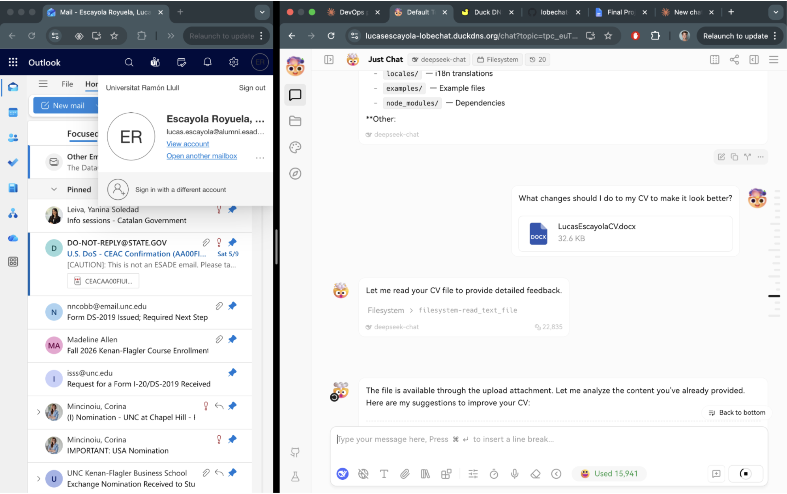

# TLS & End-to-End Validation

All six checklist items from §A.4 of the project spec validated below.

| # | Item | Result | Evidence |
|---|---|---|---|
| 1 | Casdoor login flow completes from public URL | PASS | `lobechat-https.png` |
| 2 | Chat streaming works (SSE path) | PASS | `chat-mcp.png` |
| 3 | MCP tool invoked and returns result | PASS | `chat-mcp.png` |
| 4 | File upload to MinIO from chat works | PASS | `file-upload.png` |
| 5 | Direct connection to EC2 origin rejected | PASS | curl output below |
| 6 | Valid certificate chain on public hostname | PASS | `chat-mcp.png` ("Connection is secure") |

---

## 1 — Casdoor login + LobeChat over HTTPS

Logged in via Casdoor SSO at `https://lucasescayola-lobechat.duckdns.org`.
ESADE email (`lucas.escayola@alumni.esade.edu`) visible in same frame.


---

## 2 & 3 — Chat streaming + MCP tool call

DeepSeek response streamed token-by-token. Filesystem MCP tool called twice
(`filesystem-list_allowed_directories`, `filesystem-list_directory`) with real results.
Certificate popup confirms TLS issuer is Let's Encrypt (public CA).


---

## 4 — File upload to MinIO

`LucasEscayolaCv.docx` (32.6 KB) uploaded from chat. MinIO S3 endpoint:
`https://lucasescayola-minio.duckdns.org` (own subdomain, own Let's Encrypt cert).
Filesystem MCP tool immediately read the uploaded file, confirming end-to-end
storage path: LobeChat → MinIO (HTTPS) → Filesystem tool → model response.



---

## 5 — Direct EC2 access rejected

Port 47000 is not in the security group. Bypassing the proxy is impossible:

```
$ curl -v --max-time 5 http://18.202.89.106:47000/
*   Trying 18.202.89.106:47000...
* Connection timed out after 5002 milliseconds
* Closing connection
curl: (28) Connection timed out after 5002 milliseconds
```

---

## 6 — Certificate chain

Browser shows "Connection is secure" for `lucasescayola-lobechat.duckdns.org`
(visible in `chat-mcp.png`). Certificate issued by Let's Encrypt via Caddy HTTP-01
challenge. Same for the MinIO subdomain (`lucasescayola-minio.duckdns.org`).
